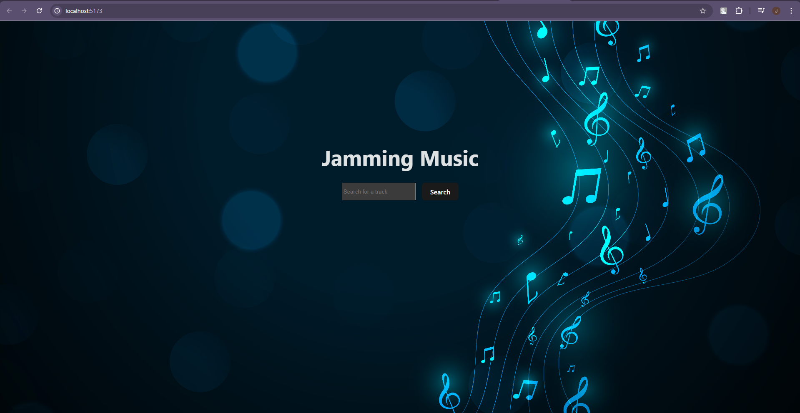
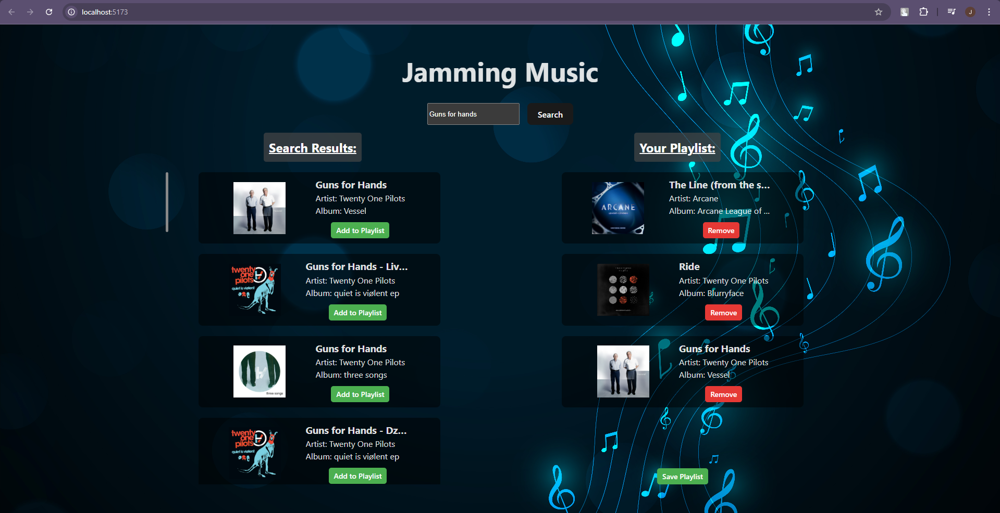
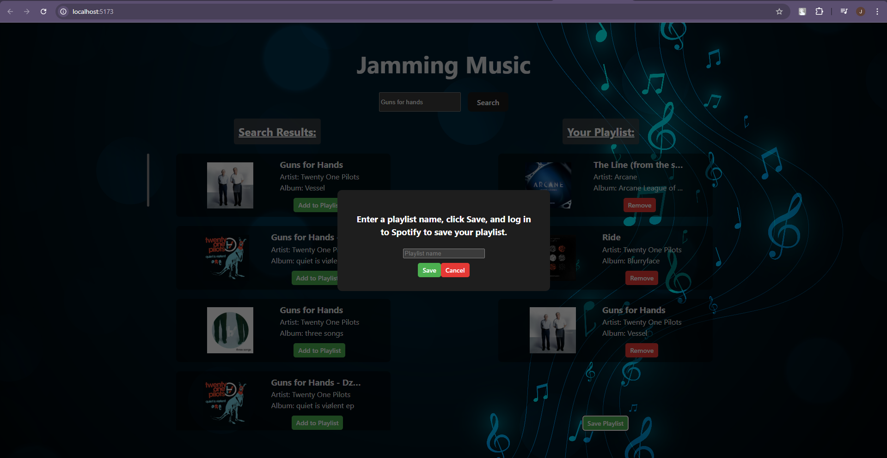

<p align="center">
  <a href="./src/assets/Preview1.png" target="_blank">
    
  </a>
  <a href="./src/assets/Preview2.png" target="_blank">
    
  </a>
  <a href="./src/assets/Preview3.png" target="_blank">
    
  </a>
</p>

# Jamming Music 🎵

Jamming Music is a React-based web application that allows users to search for songs using the Spotify API, create custom playlists, and save them directly to their Spotify account. This project demonstrates the integration of Spotify's API with modern web development practices.

# 🌐 **Live Demo**  
Check it out [here](https://jammingmusicapp.netlify.app/)

> Note: The API for this website hasn't been implemented yet, so it currently doesn't fetch data.

## Features ✨
- **Search for Songs**: Users can search for tracks using the Spotify API.
- **Create Playlists**: Add tracks to a custom playlist.
- **Save to Spotify**: Log in to Spotify and save the playlist directly to your account.
- **Responsive Design**: Works seamlessly across devices.

## Technologies Used 🛠️
- **Frontend**: React.js
- **API**: Spotify Web API
- **Authentication**: Spotify Implicit Grant Flow
- **Styling**: CSS (or any styling library you used)
- **Environment Variables**: Vite for managing sensitive credentials

## Installation & Setup 🚀
To run this project locally, follow these steps:

1. Clone the repository:
   ```bash
   git clone https://github.com/your-username/jamming-music.git
   cd jamming-music

2. Install dependencies:
    ```bash
    npm install

3. Set up your Spotify credentials:
    ```bash
    • Create a .env file in the root directory.
    • Add the following environment variables

        VITE_CLIENT_ID=your_spotify_client_id
        VITE_SECRET_CLIENT_ID=your_spotify_client_secret
        VITE_REDIRECT_URI=http://localhost:3000

4. Start the development server:
    ```bash
    npm run dev

5. Open the app in your browser:
    ```bash
    http://localhost:3000

## How to Use 📝
    1. Search for Songs:
       • Use the search bar to find tracks by name.
    2. Add to Playlist:
       • Click the "Add" button next to a track to add it to your playlist.
    3. Save Playlist:
       • Enter a playlist name, click "Save," and log in to Spotify when prompted.
       • Your playlist will be saved to your Spotify account.

## Environment Variables 🔒
    Make sure to set the following environment variables in your .env file:

    • VITE_CLIENT_ID: Your Spotify Client ID.
    • VITE_SECRET_CLIENT_ID: Your Spotify Client Secret (if using Client Credentials Flow).
    • VITE_REDIRECT_URI: The redirect URI registered in your Spotify Developer Dashboard.

## Acknowledgments 🙌
    Spotify Web API
    React.js
    Vite

## Contact 📬
If you have any questions or feedback, feel free to reach out:

- **GitHub**: [MossaCobra](https://github.com/MossaCobra)
- **Email**: jaydengalea11@gmail.com
